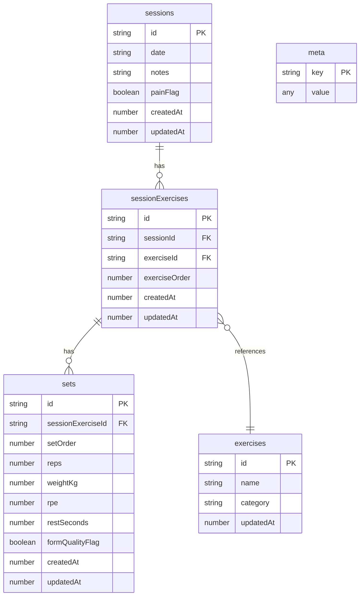
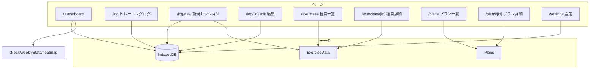

# Training App - ER図・機能構成

## 1. ER図（IndexedDB データモデル）



### 関係の説明

| 関係 | 基数 | 説明 |
|------|------|------|
| Session → SessionExercise | 1:N | 1セッションに複数の種目ブロック |
| SessionExercise → Set | 1:N | 1種目ブロックに複数セット |
| SessionExercise → Exercise | N:1 | 種目ブロックは参照データの `exerciseId` を参照 |

---

## 2. 参照データ（静的・コード埋め込み）

IndexedDB 外の静的データ。

### ExerciseData (`data/exercises.ts`)

| カラム | 型 | 説明 |
|--------|-----|------|
| id | string | PK |
| name | string | 種目名 |
| category | string \| null | push/pull/legs/core |
| purpose | string \| null | 目的 |
| instruction | string \| null | 手順 |
| advice | string \| null | アドバイス |
| formCues | string \| null | フォームのポイント |
| mistakes | string \| null | よくあるミス |
| safetyNotes | string \| null | 安全上の注意 |
| progression | string \| null | 進化形 |
| regression | string \| null | 易化形 |

### Plan (`data/plans.ts`)

| カラム | 型 | 説明 |
|--------|-----|------|
| id | string | PK |
| title | string | プラン名 |
| level | string | Beginner/Intermediate/Advanced |
| summary | string | 概要 |
| weeklyStructure | string | 週のスケジュール |
| progressionRule | string | 進捗ルール |
| days | PlanDay[] | 曜日別メニュー |

**PlanDay**: `{ day, focus, items: PlanItem[] }`  
**PlanItem**: `{ exerciseName, sets, repRange }`

---

## 3. サイト機能構成



### ルート別機能

| ルート | 機能 | 主なデータ |
|--------|------|-----------|
| `/` | ダッシュボード：ストリーク、週カウント、ヒートマップ、直近セッション | sessions, meta, core |
| `/log` | ログ一覧・日付検索、クイックログ、前回繰り返し | sessions, sessionExercises, sets |
| `/log/new` | 新規セッション作成、種目選択、セット入力、休憩タイマー | sessions, sessionExercises, sets, exercises |
| `/log/[id]/edit` | 既存セッション編集・削除 | sessions, sessionExercises, sets |
| `/exercises` | 種目カタログ（検索・カテゴリフィルタ） | ExerciseData |
| `/exercises/[id]` | 種目詳細（フォーム、手順、アドバイス） | ExerciseData |
| `/plans` | レベル別プラン一覧 | Plans |
| `/plans/[id]` | プラン詳細（曜日・種目・セット数） | Plans |
| `/settings` | バックアップ（JSON export/import） | IndexedDB 全体 |

---

## 4. meta テーブルの用途

| key | 説明 |
|-----|------|
| dailyCounts | 日別セット数（ヒートマップ用） |
| lastSetDraft | 最後のセット入力ドラフト |
| その他 | アプリ設定・キャッシュ用途の KV |

---

## 5. データフロー概要

```
[ユーザー操作]
     ↓
[app/* ページ / コンポーネント]
     ↓
[lib/localdb/repo.ts]
     ↓
[storage/indexeddb.ts / lib/localdb/db.ts]
     ↓
[IndexedDB (idb)]
```

- バックエンド API なし（完全ローカル）
- バックアップは `/settings` で JSON エクスポート/インポート
