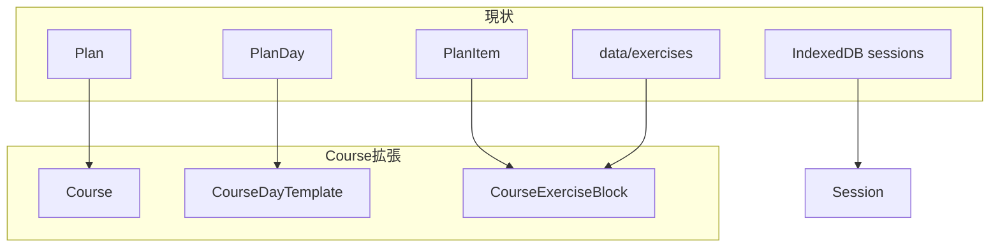

# Course 機能 実装ドキュメント

参照元: [course-example-refined.md](./course-example-refined.md)

---

## 1. 概要・スコープ

### 1.1 Core System Philosophy（要約）

本システムは単なる「ログアプリ」や「ワークアウトテンプレート集」ではなく、

> **A Structured Training Execution Engine**  
> With Configurable Planning Layer and Adaptive Progression Layer

を目指す。全モードは以下の統合層に収束する:

- Unified Session
- Unified MuscleVolumeLedger
- Unified ProgressionTracker
- Unified HeatmapEngine
- Unified RecoveryIndex

### 1.2 現行 plans との関係

| 方針 | 内容 |
|------|------|
| **採用案** | 既存 `Plan` を Course の簡易版として扱い、`courses` を新規エンティティとして追加。段階的移行で plans と courses を一時併存させる。 |
| **理由** | 既存 plans は Foundation Strength 相当の構造を持つため、Course の初期データ源として流用可能。 |

### 1.3 MVP Phase 1 のスコープ

- Unified session（既存の sessions / sets をそのまま利用）
- Single mode（Course Mode のみ。Custom Mode は将来）
- Basic course（5 Courses の静的データ + 一覧/詳細 UI）
- ログ作成時の「Course から開始」オプション（Phase 1 後半 or Phase 2）

---

## 2. データモデル設計

### 2.1 静的データ（新規型定義）

```typescript
// レベル
type CourseLevel =
  | "Beginner"
  | "EarlyIntermediate"
  | "Intermediate"
  | "Advanced"
  | "Elite";

// 週次構造
type WeeklyStructureType =
  | "LinearSplit"      // Push/Pull/Legs
  | "UpperLower"
  | "FullBody"
  | "BodyPartSplit"
  | "StrengthConditioning"
  | "SkillBased"
  | "TimeConstrained";

// DayTemplate のレイヤー（Phase 1 では簡略化）
type DayTemplateLayer =
  | "activation"
  | "primary"
  | "secondary"
  | "isolation"
  | "skill"
  | "conditioning"
  | "recovery";

// 種目ブロック（exercises.id に紐づく）
type CourseExerciseBlock = {
  exerciseId: string;      // data/exercises の id、無い場合は name でフォールバック
  exerciseName: string;    // 表示用・フォールバック
  layer?: DayTemplateLayer;
  sets: number;
  repRange: string;        // "8-12", "30-45 sec" 等
  restSeconds?: number;
  tempo?: string;          // "3-1-1" 等（Phase 2+）
};

// 日次テンプレート
type CourseDayTemplate = {
  day: string;             // "Day 1 - Push Focus"
  focus: string;
  layers?: DayTemplateLayer[];  // 利用するレイヤー（Phase 2+）
  items: CourseExerciseBlock[];
};

// Course
type Course = {
  id: string;
  title: string;
  level: CourseLevel;
  summary: string;
  weeklyStructure: string;
  weeklyStructureType?: WeeklyStructureType;
  progressionRule: string;
  daysPerWeek: number;
  equipment?: string[];    // Phase 2+
  days: CourseDayTemplate[];
};
```

### 2.2 既存型との対応

| 現状 (Plan) | Course |
|-------------|--------|
| `Plan` | `Course` |
| `PlanDay` | `CourseDayTemplate` |
| `PlanItem` | `CourseExerciseBlock` |
| `PlanItem.exerciseName` | `CourseExerciseBlock.exerciseId` + `exerciseName` |

### 2.3 exerciseId の紐づけ方針

- `data/exercises.ts` に存在する種目: `id` で紐づけ
- 存在しない種目（例: "Incline push-ups", "Knee push-up"）: `exerciseName` のみ保持し、`exerciseId` は空 or 仮ID。詳細画面では name で `/exercises?search=` にリンク（既存 plans と同様）

### 2.4 IndexedDB 拡張（Phase 2 以降）

```typescript
// 将来追加候補
type CourseEnrollment = {
  id: string;
  courseId: string;
  startedAt: string;  // ISO date
  completedDayIds?: string[];
};

type CourseProgress = {
  id: string;
  enrollmentId: string;
  sessionId: string;
  dayTemplateIndex: number;
  completedAt: number;
};
```

---

## 3. 既存構造とのマッピング



- **Plan → Course**: 既存 plans 3本を Foundation Strength 相当として `data/courses.ts` に移行 or マッピング
- **PlanItem.exerciseName → ExerciseBlock**: `data/exercises` の id にマッチする場合は `exerciseId` を設定

---

## 4. ファイル変更一覧

### 追加

| パス | 役割 |
|------|------|
| `data/courses.ts` | Course[], getCourseById, 5 Courses の定義 |
| `app/courses/page.tsx` | Course 一覧（Plans と同様のレイアウト） |
| `app/courses/[id]/page.tsx` | Course 詳細（DayTemplate 表示） |

### 変更

| パス | 変更内容 |
|------|----------|
| `app/layout.tsx` | ナビに `/courses` リンク追加 |
| `app/plans/page.tsx`, `DashboardClient.tsx`, `log/LogPageClient.tsx`, `exercises/page.tsx` | PageTabs に `{ href: "/courses", label: "Courses" }` 追加 |
| `lib/localdb/types.ts` | Phase 2 で courseEnrollment, courseProgress 追加 |
| `lib/localdb/db.ts` | Phase 2 で ObjectStore 追加 |

### 併存期間

- `data/plans.ts` は当面維持。Course 実装完了後、段階的に廃止 or リダイレクト検討

---

## 5. 実装フェーズ

| Phase | 内容 | 成果物 |
|-------|------|--------|
| **Phase 1** | 5 Courses の静的データ + 一覧/詳細 UI | `data/courses.ts`, `app/courses/*`, ナビ/PageTabs 更新 |
| **Phase 2** | セッションとの連携、進捗トラッキング | `courseEnrollment` / `courseProgress`, NewLogForm に「Course から開始」 |
| **Phase 3** | Execution State Machine, Smart Defaults | course-example-refined VI–VIII に基づく拡張 |
| **Phase 4** | Custom Mode, Periodization Builder | course-example-refined III, IX 将来拡張 |

---

## 6. 5 Courses の具体的定義

### 6.1 Foundation Strength Course

**ベース**: 既存 `data/plans.ts` の 3 本を統合・拡張

- **Level**: Beginner / Early Intermediate / Intermediate（3 段階 or 1 Course に統合）
- **Weekly Structure**: Linear Split (Push/Pull/Legs) or Full Body
- **種目カテゴリ**: Push, Pull, Lower, Core（course-example-refined IV.1 参照）
- **Progression**: Rep → Load → Tempo → ROM

**既存 plans との対応**:

- `level-1-beginner-foundation` → Foundation Strength (Beginner)
- `level-2-intermediate-strength` → Foundation Strength (Intermediate)
- `level-3-advanced-pro` → Foundation Strength (Advanced) or 別 Course

### 6.2 V-Shape Sculpt

- **Focus**: Back width, back thickness, shoulders, arms
- **種目プール**: Lat pulldown, Barbell row, Overhead press, Lateral raise, Barbell curl, Skull crusher 等
- **Structure**: Body Part Split or Upper/Lower

### 6.3 Hybrid Athlete

- **Focus**: Strength + Conditioning
- **Conditioning**: Battle rope, Sled push, Farmer carry, Box jump, Row erg, Assault bike
- **Power**: Power clean, Push press, Kettlebell swing
- **Structure**: Strength + Conditioning Hybrid

### 6.4 Bodyweight Mastery

- **Focus**: 自重スキルとプログレッション
- **Push ladder**: Knee push-up → Standard → Decline → Ring → One-arm
- **Pull ladder**: Scapular pull-up → Assisted → Pull-up → Weighted → Archer
- **Skill**: Wall handstand → Freestanding → L-sit → V-sit

### 6.5 Strategic Fat-Loss

- **Focus**: 代謝負荷
- **Tools**: EMOM, AMRAP, Circuit, Giant sets, Tabata
- **Structure**: Time-Constrained (30-min optimized)

### 6.6 data/courses.ts の JSON 構造例

```typescript
export const courses: Course[] = [
  {
    id: "foundation-strength",
    title: "Foundation Strength Course",
    level: "Beginner",
    summary: "Goal: Build strength, control, joint stability.",
    weeklyStructure: "Mon / Tue / Thu / Sat",
    progressionRule: "When you can do the top reps cleanly, increase reps or move to harder variation.",
    daysPerWeek: 4,
    days: [
      {
        day: "Day 1 - Push Focus",
        focus: "Push strength and trunk stability",
        items: [
          { exerciseId: "push-up", exerciseName: "Push-up", sets: 3, repRange: "8-12" },
          { exerciseId: "pike-push-up", exerciseName: "Pike Push-up", sets: 3, repRange: "6-10" },
          { exerciseId: "dip", exerciseName: "Dip", sets: 3, repRange: "6-8" },
          { exerciseId: "plank", exerciseName: "Plank", sets: 3, repRange: "30-45 sec" },
        ],
      },
      // ...
    ],
  },
  // V-Shape Sculpt, Hybrid Athlete, Bodyweight Mastery, Strategic Fat-Loss
];
```

---

## 7. UI/UX フロー

### 7.1 基本フロー

1. **一覧**: `/courses` → Course カード一覧（Plans と同様のグリッド）
2. **詳細**: `/courses/[id]` → タイトル、サマリー、MetadataRow、Progression Rule、DayTemplate 一覧
3. **種目リンク**: 各 ExerciseBlock を `/exercises?search={exerciseName}` へリンク（既存 plans 詳細と同様）

### 7.2 ログ作成連携（Phase 2）

- **NewLogForm** に「Course から開始」オプション追加
- Course 選択 → Day 選択 → 該当 DayTemplate の items を ExerciseBlock としてフォームに事前投入
- `repeatLastSession` と同様のパターンで `startFromCourse(courseId, dayIndex)` を実装

### 7.3 コンポーネント再利用

- `MetadataRow`, `SidebarInfo`, `StatusBadge` をそのまま利用
- `PageTabs` に Courses タブを追加
- レイアウト: `app/plans/[id]/page.tsx` をテンプレートとして流用

---

## 8. 参照元との対応

| course-example-refined セクション | 本ドキュメントでの扱い |
|-----------------------------------|------------------------|
| I. Core System Philosophy | セクション 1 で要約 |
| II. Mode Structure (Course Mode) | セクション 2（型定義）, 6（5 Courses） |
| III. Custom Mode | Phase 4 将来拡張 |
| IV. Five Courses | セクション 6 で具体化 |
| V. Analytics Expansion | Phase 2–3（Muscle Ledger, Fatigue Index 等） |
| VI. Execution Engine | Phase 2–3 で簡易版 |
| VII–IX. Smart Defaults / Builder | Phase 3–4 参照 |
| X. MVP Path | セクション 5 に反映 |

---

## 9. 実装チェックリスト（Phase 1）

- [ ] `data/courses.ts` 作成（型 + 5 Courses の最小データ）
- [ ] `app/courses/page.tsx` 作成
- [ ] `app/courses/[id]/page.tsx` 作成
- [ ] `app/layout.tsx` に Courses ナビ追加
- [ ] 各 PageTabs 使用ページに Courses タブ追加
